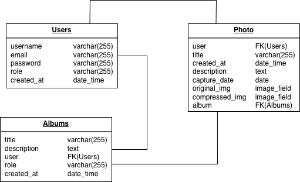
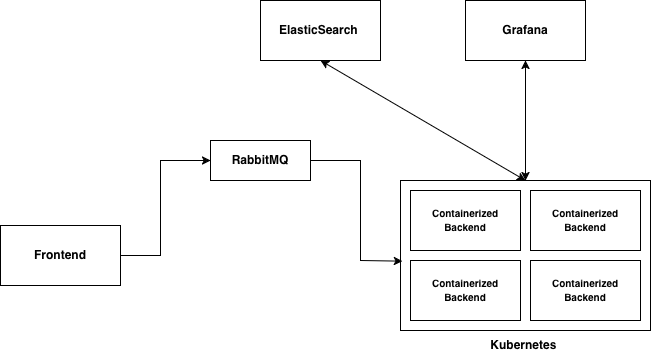

## About
TheMiddleFrameTechTask is a photography marketplace built with **Next.js** and **Django** build for tech interview for the company **TheMiddleFrame**

### Tech Stack
- **Backend**: Django
- **Frontend**: Next.js
- **Database**: PostgreSQL

### Challenges
The main challenge was developing the frontend using Next.js, as it was my first time working with the framework. I overcame this challenge by watching short tutorials on YouTube, using online templates, and leveraging AI tools to help design an attractive and responsive user interface with Tailwind CSS.

The backend was easier to develop due to my prior experience with Django. I began by planning the workflow for each functionality using activity diagrams, then defined the core entities, which were later translated into Django models. After that, I implemented the required API endpoints.

### Database Diagram
the database schema is as follows:


### System Diagram
the following diagram shows the system design, the first component is the frontend which the user will interact with, the second component is RabbitMQ which is used as queue to handle the photos processing, the third component is the backend hosted on docker containe and managed by kubernetes, the fourth component is the database hosted on postgresql.

also we can see Grafana and Prometheus which are used to monitor the system, and elasticsearch to manage the logs.


### Activity Diagram
the following activity diagram shows the workflow of the main features of the application while uploading photos:


## Getting Started

### Prerequisites

- Python 3.10+
- Node.js 18+
- PostgreSQL

### Backend Setup

```bash
cd TheMiddleFrameTechTaskBackend

# Create virtual environment
python -m venv env
source env/bin/activate

# Install dependencies
pip install -r requirements.txt

# Run migrations
python manage.py migrate

# Start server
python manage.py runserver
```

### Frontend Setup

```bash
cd TheMiddleFrameTechTaskFrontend
npm install
npm run build
npm run start
```

### Access the App

- **Frontend**: http://localhost:3000
- **Backend API**: http://localhost:8000/api

## Environment Variables

### Backend (.env)
```
SECRET_KEY=your-django-secret-key
```

### Frontend
Update `SERVER_URL` in `utils/api.js` for production.